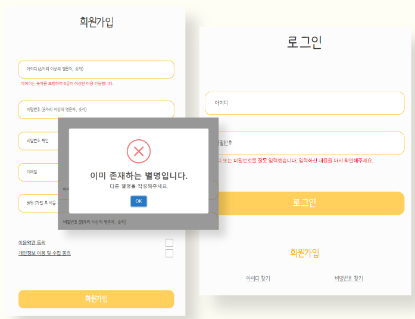
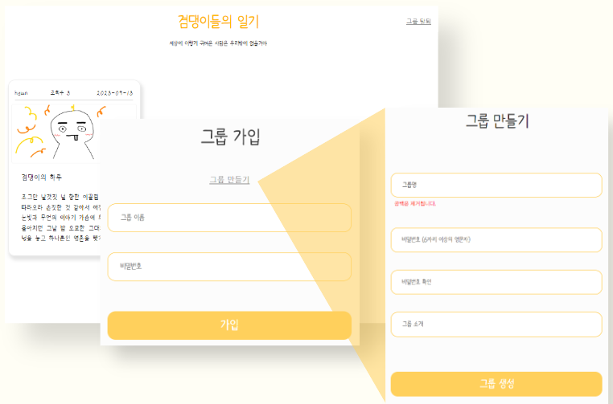
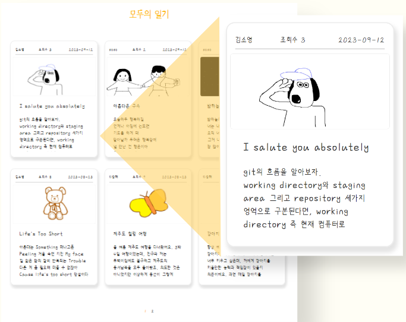
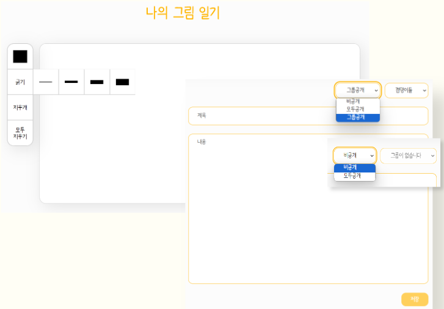
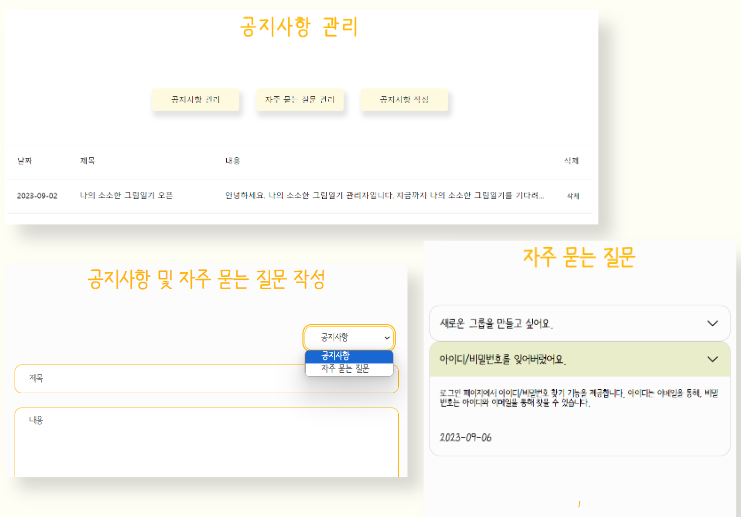
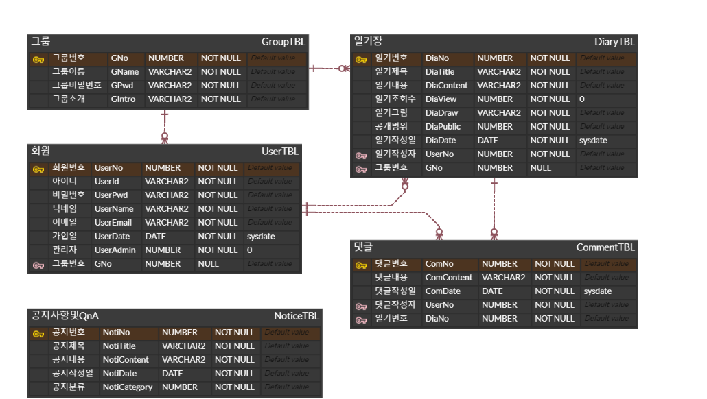

# 나의 소소한 그림일기 🎨
**나의 소소한 그림일기**는 웹에서 직접 그린 나만의 그림일기를 공유하는 커뮤니티 플랫폼입니다. 
이 프로젝트는 사용자들이 직접 그린 그림일기를 허용 범위에 따라 게시하고 다른 사용자들과 소통할 수 있는 기능을 제공합니다.
모두 공개로 설정된 다른 사용자의 그림일기에 댓글을 작성할 수 있으며,
특정 그룹에 가입하여 그룹 내에서만 공개되는 그림일기를 게시하며 그룹 내 커뮤니티를 형성할 수 있습니다.

해당 프로젝트는 이전에 진행한 팀프로젝트에서 다뤄보지 못한 게시판 기능 구현을 단독으로 경험해보고자 진행한 개인 프로젝트로, 게시판 기능의 역량 강화를 목적으로 두고 있습니다.

 

## 주요 기능
상세 내용은 [이곳](https://drive.google.com/file/d/1V3fmNXHrWF2RUDcwqnxNY2TjS2Oe7vD5/view?usp=sharing "나의 소소한 그림일기 포트폴리오")에서 확인하세요.
### Member
+ 회원가입, 로그인, 로그아웃, 아이디 찾기, 비밀번호 재설정, 회원정보 조회/수정, 마이페이지(내 일기 및 댓글 모아보기), 그룹 생성 및 가입/탈퇴
  

  
회원가입 및 로그인

  

  
  

  

  

  
그룹 생성 및 가입

  

  
  

  

### Diary
+ 비공개 일기 조회, 모두 공개 일기 조회, 그룹 공개 일기 조회, 그림일기 작성 및 삭제, 댓글 작성 및 삭제
  

  
일기 모아보기

  

  
  

  

  

  
일기 작성

  

  
  

  

### Notice
+ 공지사항 및 자주 묻는 질문 조회, 관리자 페이지, 공지사항 및 자주 묻는 질문 추가/삭제
  

  
관리자 페이지

  

  
  

  

 

## ERD

 

## 개발 환경
+ Backend: Java, Spring, MyBatis, Oracle DB, Maven
+ Frontend: HTML5, CSS3, JavaScript, jQuery, Ajax
+ Dev Tools: Eclipse, Figma
